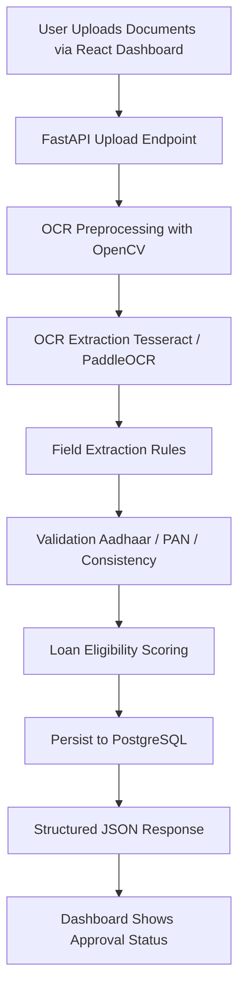

# Loan Automation Workflow

## Steps
1. User uploads loan application document set.
2. Backend applies OCR and extracts raw text.
3. Rule-based parser maps key entities (name, ID, income, balance).
4. Validator checks document quality and consistency.
5. Scoring module computes eligibility and decision state.
6. Data is stored for audit and analytics.
7. UI displays final output and validation alerts.
